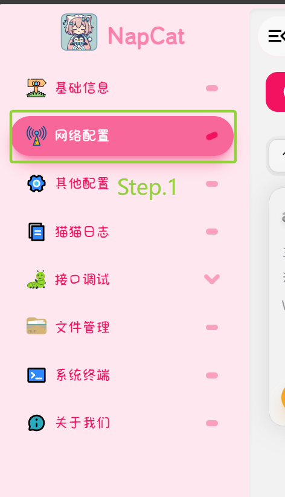
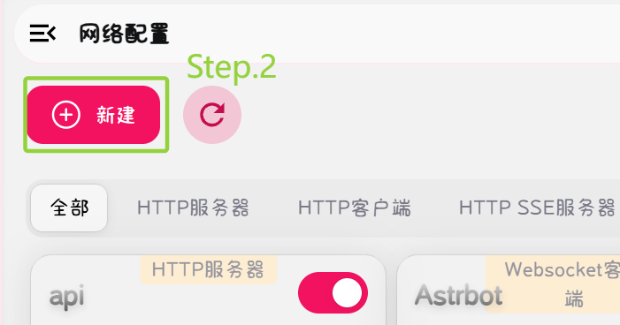
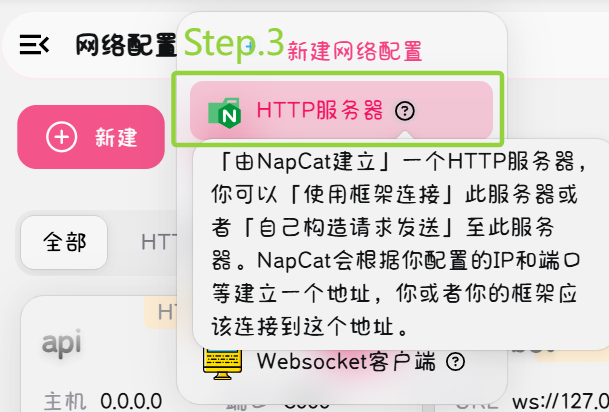
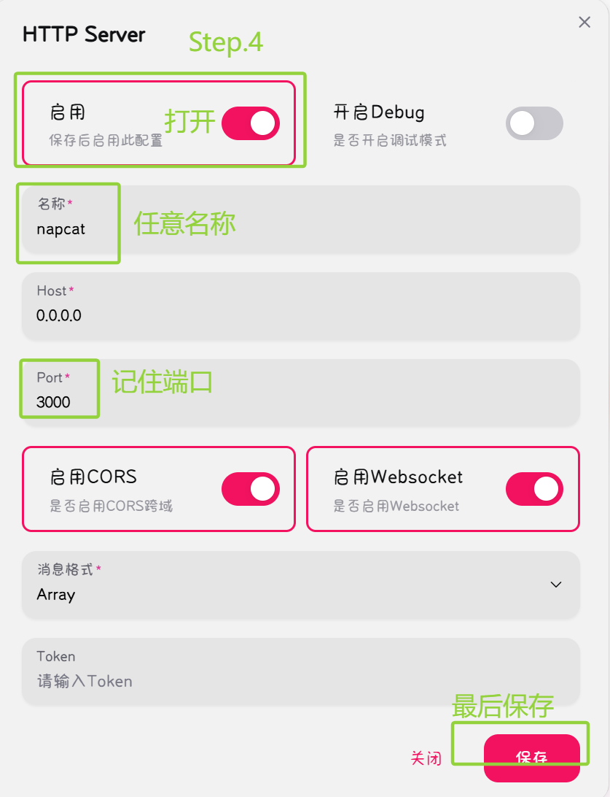
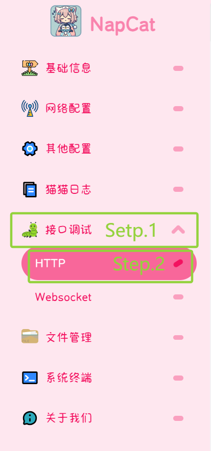
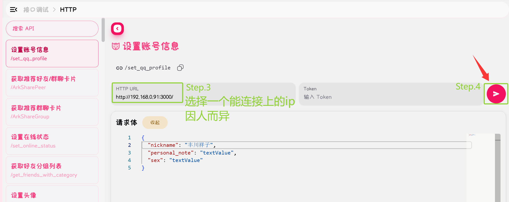
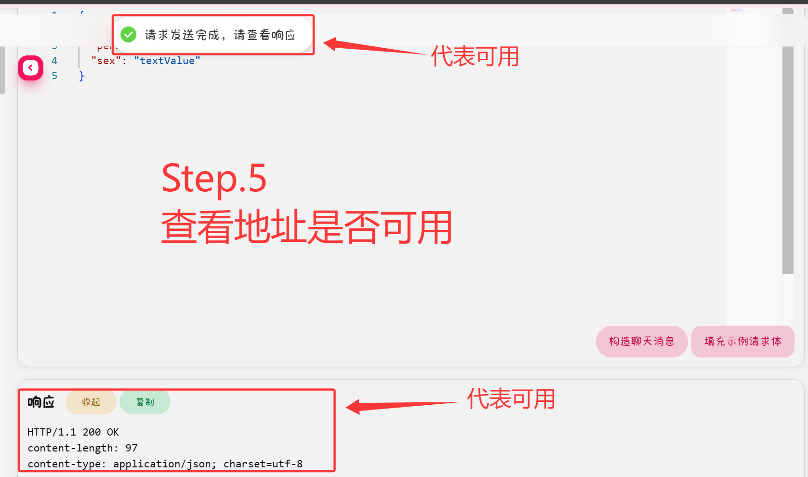
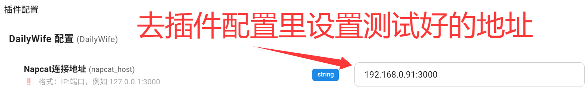
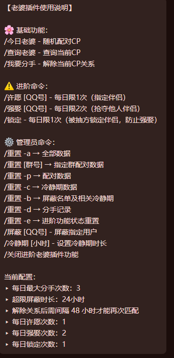

# DailyWife - QQ群每日老婆插件
# （如果是安装完插件弹出的README，可能会出现无法显示图片的情况，请手动前往GitHub仓库地址查看）
### 前置需求（一定要看！）
本插件适合搭配napcat使用
本插件依赖Napcat api服务
- 在napcat面板设置服务端口

- 测试api可用性

⚠注意此处测试的是用“设置账号信息”来测试api，如果请求体不改，bot的昵称，签名都会变成"textValue"
你也可以用这个界面的其他功能来测试api

另外说明：在napcat里面测试不成功也不要紧，
重要的是确保astrbot可以访问你的api地址，
如果astrbot也无法访问你的api，请检查防火墙、端口、网络以及容器的问题。

- 如果可用，请进行最后一步配置

## 命令说明

 **命令帮助**：输入 `/老婆菜单` 即可获取可用命令（动态的）

## 注意事项

- 如不可用请先检查napcat api是否配置好并且可用
- 有问题请提issue
- 娱乐插件，切勿当真